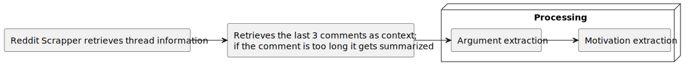
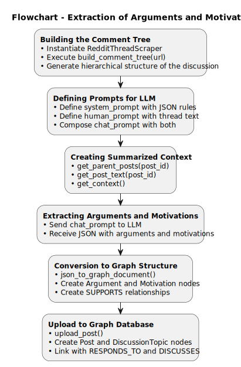

# Extracting Arguments and Motivations from E-Democracy Forums

This project is a pipeline for extracting arguments and their underlying motivations from online discussions, specifically from Reddit threads. It uses a combination of web scraping, Large Language Models (LLMs), and graph database technologies to analyze the content of the discussions and represent the relationships between different arguments and motivations.



## Features

- **Reddit Thread Scraping:** Scrapes entire Reddit threads, including all comments and their hierarchical structure.
- **Argument and Motivation Extraction:** Uses LLMs (configurable to use OpenAI or a local Ollama model) to identify and extract arguments and the motivations behind them from user comments.
- **Motivation Analysis:** Categorizes extracted motivations based on Manfred Max-Neef's Human Scale Development theory.
- **Graph-Based Data Model:** Stores the scraped data, extracted arguments, and motivations in a Neo4j graph database, capturing the relationships between posts, users, arguments, and motivations.
- **Context-Aware Summarization:** Generates summaries of motivations within each Max-Neef category.
- **Automated Evaluation:** Includes a component to evaluate the quality of the argument extraction and categorization using an LLM.
- 
<p align="center">
    
</p>

## Technologies Used

- **Python:** The core programming language for the project.
- **LangChain:** Used to build the pipeline and interact with LLMs.
- **PRAW (The Python Reddit API Wrapper):** For scraping data from Reddit.
- **Neo4j:** A graph database used to store and query the structured data.
- **Ollama:** For running local LLMs for extraction, summarization, and evaluation.
- **OpenAI:** As an alternative to Ollama for accessing powerful LLMs.
- **Sentence-Transformers:** For semantic similarity and deduplication of arguments.
- **Jupyter Notebooks:** For developing and demonstrating the different stages of the pipeline.

## Workflow

1.  **Data Scraping (`main.ipynb`):** A Reddit thread URL is provided, and the entire comment tree is scraped. Usernames are anonymized.
2.  **Extraction and Categorization (`main.ipynb`):** Each comment is processed by an LLM to extract key arguments and the motivations behind them. These motivations are then classified into Max-Neef's categories of fundamental human needs.
3.  **Graph Storage (`main.ipynb`):** The scraped posts, extracted arguments, motivations, and their relationships are all stored as nodes and edges in a Neo4j graph.
4.  **Summarization (`sumariador.ipynb`):** The system queries the graph to group arguments by their motivational category and then uses an LLM to create a summary for each category.
5.  **Evaluation (`avaliador.ipynb`):** The quality of the initial extraction is assessed. An LLM is used to score the coherence, plausibility, and categorization of the extracted information, and the results are saved.

## Setup and Installation

1.  **Clone the repository:**
    ```bash
    git clone https://github.com/your-username/Extracting-Motivations-From-E-Democracy-Forums.git
    cd Extracting-Motivations-From-E-Democracy-Forums
    ```

2.  **Install Python dependencies:**
    ```bash
    pip install -r requirements.txt
    ```

3.  **Set up environment variables:**
    Create a `.env` file in the root of the project and add the following credentials. This file is included in `.gitignore` to protect your keys.
    ```
    OPENAI_API_KEY=your_openai_api_key
    NEO4J_URI=your_neo4j_uri
    NEO4J_USERNAME=your_neo4j_username
    NEO4J_PASSWORD=your_neo4j_password
    HF_KEY=your_huggingface_api_key
    REDDIT_CLIENT_ID=your_reddit_client_id
    REDDIT_CLIENT_SECRET=your_reddit_client_secret
    ```

4.  **Set up Neo4j:**
    Make sure you have a running Neo4j instance and that the credentials in your `.env` file are correct.

5.  **Set up Ollama (Optional):**
    If you want to use local LLMs, you need to have Ollama installed and running. You can download it from [https://ollama.ai/](https://ollama.ai/).

## Usage

The project is structured into several Jupyter Notebooks, each handling a different part of the pipeline.

-   **`main.ipynb`:** The main notebook that orchestrates the scraping, extraction, and graph creation process. Open and run the cells in this notebook to process a new Reddit thread.
-   **`sumariador.ipynb`:** After running `main.ipynb`, use this notebook to generate summaries of the motivations found in the graph.
-   **`avaliador.ipynb`:** This notebook is for evaluating the performance of the extraction process.

To run the project, start with `main.ipynb` and follow the steps in the notebook. Then, you can proceed to `sumariador.ipynb` and `avaliador.ipynb` for summarization and evaluation.

## Project Structure

```
.
├── .gitignore
├── avaliador.ipynb         # Notebook for evaluating the extraction quality
├── main.ipynb              # Main notebook for scraping, extraction, and graph building
├── README.md               # This file
├── requirements.txt        # Python dependencies
├── sumariador.ipynb        # Notebook for summarizing motivations
├── dummytext/              # Dummy text files for testing
├── out/                    # Output files, such as diagrams
├── provas_de_conceito/     # Proof-of-concept scripts
└── versoes antigas/        # Older versions of the notebooks
```
